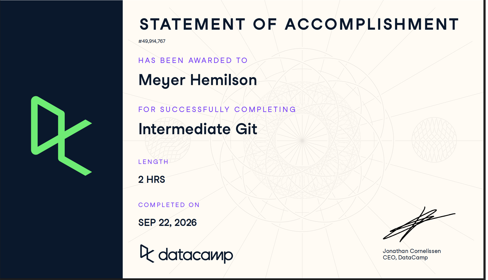

# Certificaciones de Git

Llena este archivo en **tu copia**, dentro de `estudiantes/<tu-login>/github/`.

## Quién soy

- Nombre: Meyer Hemilson
- Usuario de GitHub: Meyer03
- Correo con el que entraste a DataCamp: mhemilso@itam.mx

## Introduction to Git

Se llena en la **primera** entrega.

Fecha en que lo terminaste: 16 de septiembre de 2026

[Statement of Accomplishment de Introduction to Git](./introduccion-a-git.pdf)

## Intermediate Git

Se llena en la **segunda** entrega.

Fecha en que lo terminaste: 22/sep/2026

## Una cosa que aprendiste y no sabías

Se llena en la **segunda** entrega, cuando ya hiciste los dos cursos.

Ya entendí como moverme entre las ramas.

